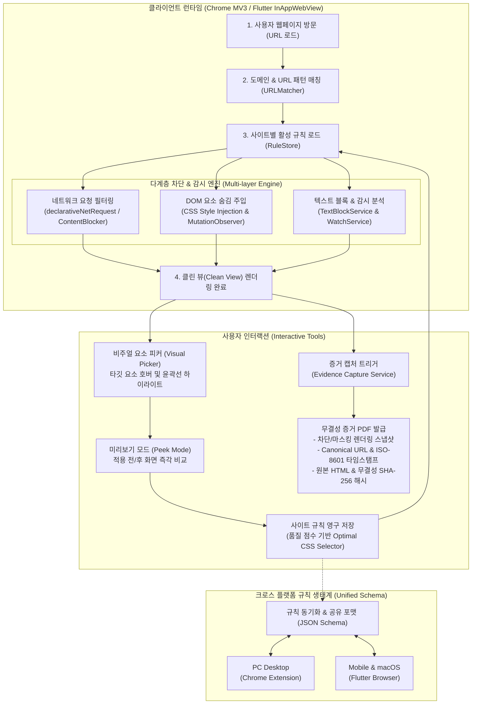

> 이전 기반 저장소 README 사본입니다. 현재 앱의 동작과 검증 상태는 새 README를 기준으로 확인하세요.

# 공개 웹사이트 불법광고 점검

현재 개발 대상은 `apps/inspector`의 npm·Playwright 점검 앱입니다. Docker 실행과 Electron Windows 패키지를 제공합니다.

```bash
cd apps/inspector
npm ci
npx playwright install chromium
npm run dev
```

Node 24 LTS를 권장합니다. 기본 저장 위치는 `apps/inspector/output/`이며 화면에 실제 경로를 표시합니다. 자세한 실행법은 [앱 안내](apps/inspector/README.md), 제출용 사용설명서는 [usage.md](docs/submission/usage.md)에 있습니다.

실제 Windows 11 실행, 실제 CLEF 추론과 저장소 전체 배포 권리는 아직 확인되지 않았습니다.

---

## 기존 소비자 제품 설명

아래는 기존 Flutter 브라우저·확장의 제품 설명입니다. 새 점검 앱과 실행 경로가 다릅니다.

# ✂️ Infocutter (인포커터)

> **"매번 닫던 광고와 방해 요소를 한 번만 찍어두면, 그 사이트는 계속 조용해집니다."**  
> 보고 싶은 것만 남기는 크로스 플랫폼 웹 화면 커스텀 정리 및 증거 보존 스위트.

[](extensions/chrome)
[](extensions/chrome)
[](apps/browser)


---

## 1. 왜 인포커터인가? (Why Infocutter?)

### 🚨 웹서핑과 업무가 겪는 고통 (The Problem)

1. **쏟아지는 시각적 공해와 집중력 분산**
   - 일반 광고 차단기(AdBlock)는 배너 광고 스크립트만 막을 뿐, 본문 주변을 덮은 **추천 피드, 실시간 랭킹 박스, 스폰서드 콘텐츠, 떠다니는 플로팅 배너, 로그인 유도 팝업**을 거르지 못합니다.
   - 특정 인물, 지겨운 뉴스 키워드, 스포일러 문구가 포함된 섹션이 화면을 장악하여 읽기 흐름과 업무 몰입을 지속적으로 방해합니다.

2. **PC와 모바일 간의 차단 경험 파편화**
   - 데스크톱 브라우저에서 아무리 깨끗하게 정리해 두어도, 모바일로 접속하는 순간 광고와 불필요한 배너가 다시 화면을 가득 채웁니다. 모바일 브라우저 환경에서는 정밀한 사용자 정의 DOM 차단 도구가 턱없이 부족했습니다.

3. **신뢰할 수 있는 웹 증거 보존(Audit Trail)의 한계**
   - 연구자, 분석가, 지식 노동자, 법적 증거 수집자가 웹 화면을 보존할 때 단순 스크린샷은 위변조 위험과 신뢰성 문제가 따릅니다.
   - 화면의 특정 영역을 가리거나 특정 키워드가 등장한 당시의 원본 웹 상태(URL, 시각, 해시값)를 투명하게 박제할 수단이 필요했습니다.

---

### 💡 인포커터의 해법 (The Solution)

| 문제 영역 | 인포커터의 솔루션 | 제공 가치 |
|---|---|---|
| **복잡한 노이즈 영역** | **비주얼 DOM 요소 피커** | 클릭 한 번으로 최적의 CSS Selector를 추출해 재방문 시 영구 자동 은닉 |
| **텍스트/키워드 소음** | **텍스트 블록 & 키워드 감시(Watch)** | 특정 문구/인물 포함 영역 자동 마스킹 및 관심 키워드 출현 시 실시간 알림 |
| **증거 수집의 신뢰성** | **증거 PDF 캡처 (Evidence Vault)** | URL, ISO-8601 타임스탬프, 콘텐츠 SHA-256 해시가 봉인된 PDF 문서 생성 |
| **플랫폼 간 분단** | **통합 규칙 스키마 (Unified Rule)** | PC(Chrome MV3) ↔ Mobile(Flutter Browser) 간 완벽하게 일치하는 차단 경험 |

---

## 2. 비즈니스 로직 & 라이프사이클 (Architecture & Business Logic)

인포커터는 사용자가 웹페이지를 방문하는 순간부터 규칙 매칭, 다계층 렌더링 차단, 상호작용 피커 및 증거 캡처에 이르기까지 정교한 파이프라인으로 동작합니다.



### ⚙️ 핵심 파이프라인 단계

1. **URL 매칭 및 규칙 인덱싱**: 브라우저가 새 페이지로 이동하면 `URLMatcher`가 도메인 및 경로를 검사하고, 로컬 스토리지에서 해당 사이트에 등록된 CSS selector, 텍스트 블록 키워드, 네트워크 차단 목록을 밀리초 단위로 색인합니다.
2. **사전 네트워크 차단**: 브라우저 레벨(Chrome `declarativeNetRequest`, Mobile `ContentBlocker`)에서 불필요한 트래커나 광고 스크립트의 네트워크 요청을 렌더링 전에 원천 차단합니다.
3. **DOM 스타일 주입 & 동적 MutationObserver**:
   - 페이지 로드 즉시 저장된 CSS Selector를 `<style>` 태그로 헤드에 주입하여 깜빡임(FOUC) 없이 요소를 즉시 숨깁니다.
   - SPA(React, Vue 등)나 무한 스크롤 환경에서도 신규 생성되는 요소를 추적하기 위해 `MutationObserver`를 가동하여 일관된 숨김 상태를 유지합니다.
4. **텍스트 노드 순회 & 키워드 감시(Watch)**:
   - 텍스트 블록 엔진이 DOM 트리 내 텍스트 노드를 실시간 스캔하여 사용자가 지정한 금지어·키워드가 포함된 부모 컨테이너를 마스킹합니다.
   - 감시(Watch) 대상 키워드가 포착되면 시스템 알림을 발생시켜 관심 정보를 놓치지 않게 지원합니다.
5. **무결성 증거 캡처**:
   - 사용자가 증거 캡처를 실행하면 화면 렌더링 스냅샷(PNG)과 전체 DOM HTML을 추출하고, 암호화 해시(SHA-256)와 시스템 타임스탬프 메타데이터를 결합하여 법적/업무적 효력을 갖춘 단일 PDF 문서를 생성합니다.

---

## 3. 4대 핵심 기능 (Core Features)

### 1) 🎯 DOM 요소 피커 & 셀렉터 차단 (Visual Element Cutter)
- **외과수술식 영역 제거**: 마우스 호버(PC) 또는 터치(모바일)로 웹페이지 위의 어떤 요소든 정밀하게 선택할 수 있습니다.
- **스마트 셀렉터 엔진**: 단순 태그가 아닌 고유 ID, 클래스, 계층 관계를 분석하여 가장 안전하고 깨끗한 CSS Selector(`selectorCandidates`)를 자동 산출합니다.
- **오탐 방지 미리보기(Peek)**: 규칙을 영구 저장하기 전에 가려질 영역을 즉시 켜고 꺼보며(Peek) 레이아웃 붕괴 여부를 사전에 검증할 수 있습니다.

### 2) 🚫 텍스트 블록 & 키워드 감시 (Text Block & Watchlist)
- **키워드 기반 컨테이너 마스킹**: 보기 싫은 인물명, 특정 사건, 혐오 문구, 스포일러 텍스트를 등록해 두면 해당 텍스트가 포함된 피드/기사 카드 전체를 자동으로 블라인드 처리합니다.
- **실시간 관심 키워드 모니터링**: 특정 기업명, 주식 종목, 기술 키워드를 등록하면 페이지 로드 시 해당 키워드의 출현 여부를 감지해 브라우저 알림으로 안내합니다.

### 3) 📜 무결성 증거 보존 PDF 캡처 (Evidence Vault)
- **원클릭 웹 아카이빙**: 현재 화면의 시각적 렌더링 상태(PNG)와 DOM 구조(HTML)를 한 번에 패키징합니다.
- **위변조 방지 메타데이터**: 캡처 당시의 표준 URL, 정확한 생성 일시(ISO-8601), 콘텐츠 바이트 기반 **SHA-256 해시값**을 헤더와 매니페스트에 각인하여 변경 불가능한 디지털 증거 PDF를 출력합니다.

### 4) 🔄 크로스 플랫폼 일관성 (Unified Cross-Platform Suite)
- **단일 규칙 스키마**: Chrome Extension과 모바일 Flutter Browser 간의 규칙 포맷이 호환됩니다.
- PC에서 등록한 규칙을 내보내 모바일 브라우저로 가져오거나, 모바일에서 픽킹한 규칙을 PC 환경에 그대로 적용할 수 있습니다.

---

## 4. 프로젝트 구성 (Monorepo Layout)

```
infocutter-mono/
├── apps/
│   └── browser/               # [Infocutter Browser] Flutter 기반 모바일 & macOS 브라우저
│       ├── lib/infocutter/    # Core 로직 (SelectorEngine, EvidenceService, WatchService 등)
│       └── assets/js/         # WebView 주입용 사용자 스크립트 (picker, runtime, capture)
├── extensions/
│   └── chrome/                # [Infocutter Extension] Manifest V3 크롬 확장 프로그램
│       ├── src/               # 확장 프로그램 프론트엔드/백그라운드/컨텐트 스크립트
│       └── infocutter         # 개발/빌드 통합 CLI 러너
├── packages/
│   ├── ext-runtime/           # 확장 프로그램 공통 런타임 레이어
│   └── ext-build/             # 번들링, 감시(watch), 패키징 파이프라인
└── README.md                  # 본 문서
```

---

## 5. 빠른 시작 (Quick Start)

### 💻 Chrome 확장 프로그램 개발

확장 프로그램 루트의 통합 도구 `./infocutter`를 사용합니다.

```bash
cd extensions/chrome

# 의존성 진단 및 헬스 체크
./infocutter doctor

# 개발 모드 빌드 및 감시
./infocutter dev
```
> **크롬 로드 방법**: `chrome://extensions` 접속 → '개발자 모드' 활성화 → '압축해제된 확장 프로그램을 로드합니다(Load unpacked)' 클릭 → `extensions/chrome/dist` 디렉터리 선택.

### 📱 Infocutter 모바일 브라우저 (Flutter)

```bash
cd apps/browser

# 의존성 설치
fvm flutter pub get

# 디바이스 실행 (ios / android / macos)
fvm flutter run -d macos
```

---

## 6. 라이선스 (License)

저장소 루트 LICENSE가 없어 전체 소스의 배포 라이선스는 확정되지 않았습니다. `apps/browser/LICENSE`의 Apache 라이선스와 개별 의존성 고지는 별도로 보존합니다. 전체 저장소를 MIT로 간주하지 마세요.
