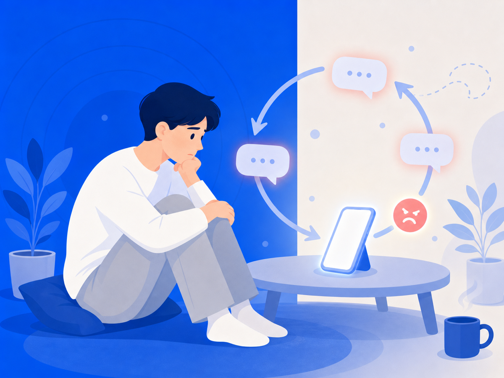

# 안 보려는데 왜 자꾸 또 열게 될까요

"다시는 안 봐야지" 하고 다짐했는데, 어느새 검색창을 열고 있죠. 읽고 나면 후회하면서도 다음 날 또 같은 걸 반복해요. 그러면서 드는 생각 — "내가 왜 이러지, 나 약한 거 아닌가."

아니에요. 이건 당신 잘못이 아니에요.

## 뇌는 원래 나쁜 것에 더 강하게 반응해요

심리학에서 말하는 '부정성 편향(negativity bias)'이 있어요. 쉽게 말하면, 뇌가 나쁜 건 크게 듣고 좋은 건 작게 듣는 방식으로 설계돼 있다는 거예요.

화난 얼굴은 웃는 얼굴보다 눈에 먼저 들어오고, 나쁜 소식은 좋은 소식보다 훨씬 오래 기억에 남아요. 이건 병이 아니에요. 위험한 환경에서 살아남기 위해 우리 조상들이 물려준 본능이에요.

악플은 뇌에게 '위협 신호'예요. 뇌는 그 위협이 얼마나 큰지, 아직도 계속되고 있는지 확인하려 해요. 그래서 보기 싫어도 자꾸 확인하게 되는 거예요.

## 읽은 뒤에도 머릿속에서 계속 재생돼요

확인하는 것에서 끝나지 않아요. 읽은 내용을 머릿속에서 반복해서 되새기는 '반추(rumination)'가 시작되거든요. "왜 저런 말을 했을까", "내가 뭘 잘못했나"처럼 같은 생각이 루프처럼 돌아요.

잠이 안 오고, 집중이 안 되고, 악플을 직접 보지 않는 순간에도 그 내용이 머릿속에서 떠나질 않아요. 방송통신위원회와 한국지능정보사회진흥원의 2023년 사이버폭력 실태조사에서도 청소년의 사이버폭력 피해 경험률은 21.6%로 나타났고, 피해자 중 상당수가 심리적 상처가 치유되지 않는다고 응답했어요. 혼자 겪는 일이 아니에요.

## 반복해서 보면 상처가 계속 새로 생겨요

악플을 자꾸 다시 확인하는 건, 아문 상처를 자꾸 건드리는 것과 같아요. 실제로 악플 피해자 중에는 이사를 결심하거나, 하던 일을 포기하거나, 전문적인 치료까지 받게 되는 경우가 있어요. 한 번의 댓글이 그 정도 무게를 가질 수 있다는 게 놀랍지만, 반복 노출이 쌓이면 그렇게 돼요.

## 그래서 오늘 할 수 있는 건

"안 보겠다"는 다짐만으로는 이 굴레를 끊기가 정말 어려워요. 뇌의 위협 탐색 충동은 의지로 막기엔 너무 자동적이거든요.

오늘 당장 한 가지만 해 보세요. 자꾸 열게 되는 페이지나 계정을 차단하거나 알림을 꺼두는 것. 완전히 안 볼 수는 없어도, 최소한 그 내용이 먼저 눈에 들어오는 걸 막는 환경을 만드는 거예요. 구조를 바꾸는 게 의지보다 훨씬 효과적이에요.

자꾸 보게 되는 건 약해서가 아니에요. 지금 거기서 한 발 벗어나는 게 당신이 할 수 있는 가장 용감한 일이에요.

> 이 글은 일반 정보예요. 구체적인 일은 전문가(상담·변호사)와 상의하세요. 많이 힘들 땐 자살예방상담 109(24시간)가 있어요.

## 참고 자료
- [인간은 부정성 편향이 있다, 경북매일](https://www.kbmaeil.com/article/202110170318288)
- [부정성 편향: 어떻게 이용하고 극복할 것인가, 내 삶의 심리학 mind](http://www.mind-journal.com/news/articleView.html?idxno=1138)
- [2023년도 사이버폭력 실태조사 결과 발표, 대한민국 정책브리핑](https://m.korea.kr/briefing/pressReleaseView.do?newsId=156621913)
- [이사하고, 꿈 접고, 정신과 치료까지… 악플 피해자들의 절규, 한국일보](https://www.hankookilbo.com/News/Read/202004030002099002)
