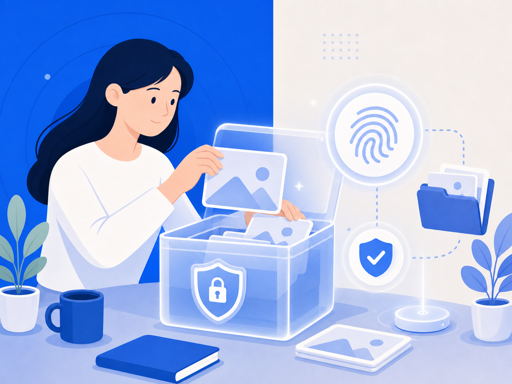

# 캡처 한 장, 법원에서도 통할까 — 동일성·무결성이 뭔지 알면 달라져요

악플을 캡처해 뒀는데, 막상 고소를 준비하려니 "이게 진짜 증거가 될까?" 싶은 불안, 느껴본 적 있으신가요. 저장해둔 파일이 법원에선 다르게 보일 수 있다는 이야기, 차분히 짚어 드릴게요.

## 법원이 디지털 파일을 볼 때 따지는 두 가지

**동일성**은 "법정에 낸 파일이 원본과 같은가"를 묻는 요건이에요. **무결성**은 "수집·보관 과정에서 조작되거나 바뀐 게 없는가"예요. 이 두 가지가 모두 충족돼야 증거능력이 인정돼요.

대법원 2017도13263 판결(2018. 2. 8.)은 이 기준을 명확히 했어요. 전자문서가 증거로 인정되려면 원본과 제출 파일의 해시값 비교, 수집·전달·보관 관여자의 진술, 검증·감정 결과를 종합해 동일성을 구체적으로 증명해야 한다고 했거든요. 같은 사건에서 파일 20개의 해시값이 원본과 달랐고, 해당 파일들은 증거능력이 부정됐어요.

## 해시값, 왜 중요한 거예요

해시값은 파일 내용을 수학 함수로 변환한 고정 길이 문자열이에요. 파일이 단 1바이트라도 바뀌면 해시값이 완전히 달라져요. "이 파일은 수집 이후 손대지 않았다"는 걸 객관적으로 보여주는 지문 같은 거예요.

수사기관이 현장에서 디지털 증거를 압수할 때 원본과 사본의 해시값을 그 자리에서 맞춰보는 이유가 바로 이 때문이에요. 전체 이미지 파일의 해시값만으로는 개별 파일 하나하나의 동일성을 검증하기 어렵다는 것도 같은 판결에서 강조된 부분이에요.

## 단순 스크린샷이 약한 이유

일반 스크린샷은 촬영 시각, 원본 URL, 편집 여부를 독립적으로 확인할 방법이 없어요. 화면에 작성자 이름이나 날짜가 보여도 "이 이미지 자체가 조작되지 않았다"는 보장이 없거든요. 수사기관이나 법원이 단순 캡처를 직접 증거보다 보조 자료로 보는 경우가 많은 게 그래서예요.

## 지금 할 수 있는 것

캡처할 때부터 URL·게시 시각·작성자 정보를 함께 담아 두세요. 가능하면 페이지 전체를 PDF로 저장해 두는 게 좋아요. 자가 보존 단계에서 동일성·무결성 주장의 근거를 미리 마련해 두는 거예요. 다만 이건 1차 보존 자료예요. 법적 효력을 강화하려면 공증·디지털 포렌식 전문기관의 도움이 별도로 필요해요.

증거 하나가 나중에 얼마나 큰 차이를 만드는지, 이 글이 조금이라도 도움이 됐으면 해요.

> 이 글은 일반 정보예요. 구체적인 일은 변호사와 상의하세요. 많이 힘들 땐 자살예방상담 109(24시간)가 있어요.

## 참고 자료
- [대법원 2018. 2. 8. 선고 2017도13263 판결 — CaseNote](https://casenote.kr/%EB%8C%80%EB%B2%95%EC%9B%90/2017%EB%8F%8413263)
- [디지털 증거의 증거능력 요건 중 무결성 및 동일성에 대하여 — KCI 논문](https://www.kci.go.kr/kciportal/ci/sereArticleSearch/ciSereArtiView.kci?sereArticleSearchBean.artiId=ART002343517)
- [검사가 제출한 디지털 증거가 증거능력을 인정받지 못하게 된 이유는? — 대법원 국민사법포털](https://www.scourt.go.kr/portal/gongbo/PeoplePopupView.work?gubun=21&seqNum=1968)
- [일상 속 디지털 증거 확보 중요성 및 수집 방법 — 법무법인 대륜 포렌식](https://www.daeryunlaw-forensic.com/lawInfo_new/9689)
