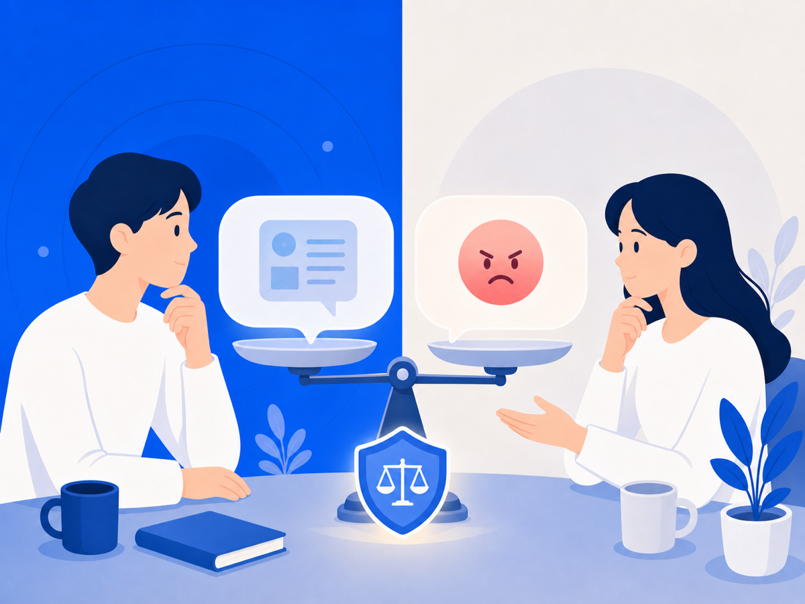

# 명예훼손이에요, 모욕이에요? — 한 끗 차이가 처벌 수위를 바꿔요

누군가 온라인에 나에 관한 글을 올렸을 때, "이게 명예훼손인가, 모욕인가?" 하는 질문이 들 수 있어요. 느끼는 고통은 비슷해도 법적으로는 구분되고, 그 차이가 적용 법률과 처벌 수위를 완전히 바꿔요. 복잡해 보이지만 핵심은 하나예요. **구체적인 사실을 적시했는지**예요.

## 사이버 명예훼손 — 정보통신망법 제70조

인터넷·SNS 등 정보통신망을 통한 명예훼손에는 형법이 아닌 「정보통신망 이용촉진 및 정보보호 등에 관한 법률(정보통신망법)」 제70조가 우선 적용돼요.

핵심 요건은 세 가지예요.

1. **비방 목적** — 타인을 해치려는 의도가 있어야 해요. 다만 법원은 비방 목적과 공익 목적이 함께 있을 때 주된 동기가 무엇인지를 종합해 판단해요.
2. **정보통신망을 통한 공공연한 공표** — 불특정 다수가 볼 수 있는 온라인 공간이어야 해요.
3. **구체적 사실 적시** — 증거로 확인 가능한 과거·현재의 구체적 사실이어야 해요.

처벌 수위는 사실 여부에 따라 달라요. 사실을 적시한 경우 3년 이하 징역 또는 3천만 원 이하 벌금, **거짓 사실**을 적시한 경우 7년 이하 징역 또는 5천만 원 이하 벌금이에요(정보통신망법 제70조 제1·2항). 단, 피해자의 명시적 의사에 반해 공소를 제기할 수 없는 반의사불벌죄예요(같은 조 제3항).

## 모욕죄 — 형법 제311조

모욕죄는 형법 제311조에 규정돼 있어요. "사실을 적시하지 않고" 경멸적 표현이나 추상적 판단으로 상대방의 사회적 평가를 떨어뜨리는 행위예요. 구체적 사실 없이 욕설·조롱만 했다면 명예훼손이 아닌 모욕죄에 해당해요.

처벌은 1년 이하 징역이나 금고 또는 200만 원 이하 벌금이에요. 피해자가 고소해야만 처벌할 수 있는 **친고죄**예요.

성립하려면 공연성이 있어야 해요. 공연성이란 "불특정 또는 다수인이 인식할 수 있는 상태, 또는 여러 사람에게 퍼질 가능성이 있는 상태"예요. SNS 게시물이나 공개 댓글은 대체로 공연성이 인정돼요.

## 두 죄의 차이 한눈에

| 구분 | 사이버 명예훼손(정보통신망법 제70조) | 모욕죄(형법 제311조) |
|---|---|---|
| 핵심 요소 | 구체적 사실 적시 | 사실 없이 경멸적 표현 |
| 비방 목적 | 필요 | 불필요 |
| 최대 처벌 | 7년 이하 징역, 10년 이하 자격정지 또는 5천만 원 이하 벌금(허위사실) | 1년 이하 징역 |
| 소추 방식 | 반의사불벌죄 | 친고죄 |

## 어느 쪽이든 증거가 먼저예요

어느 쪽이든 고소를 준비하려면 **내용 + 맥락 + 시각**이 함께 보존된 증거가 필요해요. "이 말이 언제, 어디서, 어떤 맥락으로 게시됐는지"가 요건 충족 여부를 가르기 때문이에요.

법률 요건 판단은 사안마다 달라요. 구체적인 상황은 반드시 변호사 상담을 받으세요.

> 이 글은 일반 정보예요. 구체적인 일은 변호사와 상의하세요. 많이 힘들 땐 자살예방상담 109(24시간)가 있어요.

## 참고 자료
- [정보통신망 이용촉진 및 정보보호 등에 관한 법률 제70조 — CaseNote](https://casenote.kr/%EB%B2%95%EB%A0%B9/%EC%A0%95%EB%B3%B4%ED%86%B5%EC%8B%A0%EB%A7%9D_%EC%9D%B4%EC%9A%A9%EC%B4%89%EC%A7%84_%EB%B0%8F_%EC%A0%95%EB%B3%B4%EB%B3%B4%ED%98%B8_%EB%93%B1%EC%97%90_%EA%B4%80%ED%95%9C_%EB%B2%95%EB%A5%A0/%EC%A0%9C70%EC%A1%B0)
- [인터넷 명예훼손이란 — 찾기쉬운 생활법령정보](https://easylaw.go.kr/CSP/CnpClsMain.laf?popMenu=ov&csmSeq=293&ccfNo=1&cciNo=1&cnpClsNo=1)
- [명예훼손 및 모욕죄로 처벌할 수 있나요? — 찾기쉬운 생활법령정보](https://www.easylaw.go.kr/CSP/CnpClsMainBtr.laf?popMenu=ov&csmSeq=1575&ccfNo=3&cciNo=1&cnpClsNo=1)
- [모욕죄 성립요건 판단 기준 — 법무법인 대륜 형사](https://www.daeryunlaw-detective.com/lawInfo_new/8938)
- [사이버명예훼손죄의 형사고소 절차 및 증거 — 법무법인 고운](https://gounlaw.com/legal-information/legal-information/56)
