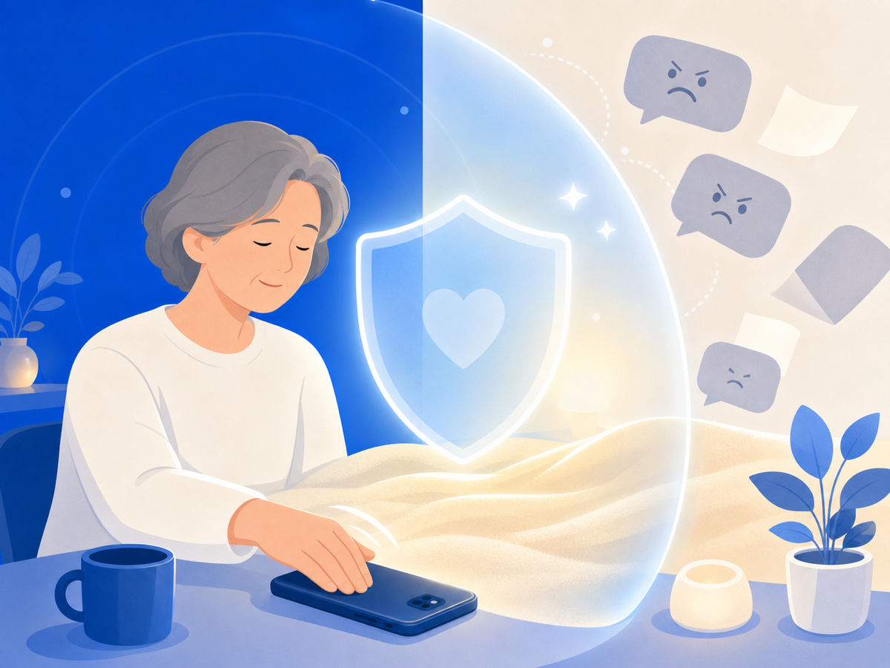

# '그만 보기'는 회피가 아니라 자기 보호예요

악플을 안 보겠다고 결심해도 마음 한구석이 찜찜하죠. "혹시 더 심해지면?", "증거를 남겨야 하는데 그냥 차단해도 되나?" 그래서 차단하고 싶으면서도 못 하고, 안 보고 싶으면서도 계속 확인하게 돼요.

이 모순이 피해를 더 길게 끌어가는 원인이에요.

## 전문가들이 가장 먼저 권하는 건 '차단'이에요

사이버폭력 전문가들이 피해자에게 가장 먼저 권하는 행동 중 하나는 가해자 차단, 그리고 해당 콘텐츠에서 거리 두기예요. 이게 회피처럼 느껴질 수 있는데, 전문가들의 시각은 달라요.

즉각 반응하거나 내용을 자꾸 다시 보는 건 오히려 상황을 악화시킬 수 있어요. 감정을 먼저 안정시키는 게 중요하다는 거예요. 사이버불링은 시공간의 제약 없이 이어지고, 피해자들은 절망감과 무기력감을 경험해요. 그 고리를 끊는 첫 번째 행동이 차단이에요.

## '안 보기'는 도망이 아니에요

피해를 당한 상황에서 그 내용에 계속 노출되는 건, 상처를 스스로 반복해서 건드리는 것과 같아요. 카스퍼스키의 사이버폭력 영향 연구에 따르면, 폭력이 멈춘 뒤에도 피해자는 오랫동안 수치심과 무력감을 경험해요.

상처가 아물려면 새로운 자극을 최소화하는 환경이 필요해요. 안 보는 것은 포기가 아니에요. 자신의 회복을 위해 유해한 자극으로부터 거리를 두는, 적극적인 자기 보호예요.

## 그런데 증거는 어떡하죠

여기서 현실적인 모순이 생겨요. 사이버폭력 대응에서 전문가들은 증거 보존도 강조해요. 신고와 법적 대응 모두 증거가 필요하거든요.

"안 봐야 하는데, 증거는 남겨야 한다." 이 모순이 피해자를 다시 그 내용 앞으로 데려와요.

## 그래서 오늘 할 수 있는 건

안 보면서 증거를 남기는 방법이 있어요. 지금 당장 가해 계정을 차단하고 알림을 꺼두세요. 그리고 화면을 남겨야 할 때는 직접 오래 들여다보지 않고도 화면을 캡처하거나 저장할 수 있는 방법을 찾아보세요. URL과 날짜가 보이도록 저장하는 게 핵심이에요.

그만 보는 것은 당신이 약해서가 아니에요. 지금 할 수 있는 가장 현명한 보호예요.

> 이 글은 일반 정보예요. 구체적인 일은 전문가(상담·변호사)와 상의하세요. 많이 힘들 땐 자살예방상담 109(24시간)가 있어요.

## 참고 자료
- [사이버불링 대응방법, 로톡](https://www.lawtalk.co.kr/posts/82416)
- [사이버 불링, 어떻게 예방하고 대처해야 할까, 정신의학신문](https://www.psychiatricnews.net/news/articleView.html?idxno=36480)
- [사이버 폭력의 영향에는 어떤 게 있을까요, 카스퍼스키](https://www.kaspersky.co.kr/resource-center/preemptive-safety/cyberbullying-effects)
- [사이버불링의 이해와 대책, 한국청소년정책연구원](https://www.nypi.re.kr/lib/10120/contents/6209770)
