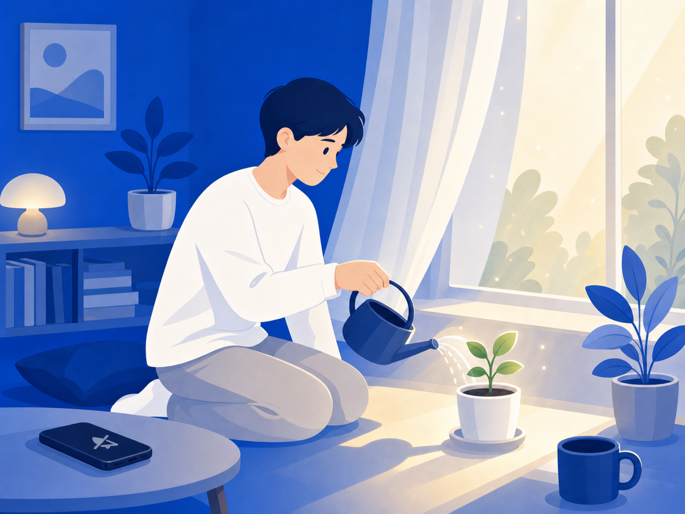

# 악플 뒤에도 다시 일어설 수 있어요

"왜 나만 이런 일이 생기지." 악플을 받고 나면 이런 생각이 들죠. 이제 뭔가를 올리려다 손가락이 멈칫하고, 알림이 울릴 때마다 가슴이 철렁 내려앉아요. 그건 당신이 약한 게 아니에요. 고통에 자연스럽게 반응하는 거예요.

## 회복탄력성은 성격이 아니에요

심리학에서 말하는 회복탄력성(resilience)은 어려움에서 적응하고 다시 일어서는 능력이에요. 그런데 중요한 건 — 이게 타고난 성격이 아니라는 거예요. 환경과 관계 속에서 발달하는 능력이고, 조금씩 키울 수 있어요. 참사람의 심리 자료에 따르면 회복탄력성은 나이·성별·문화에 따라 다르게 나타나는 역동적 특성이고, 수동적으로 견디는 게 아니라 자신의 강점을 써서 능동적으로 만들어가는 과정이에요.

악플 이후 어떤 사람은 빠르게 털고 일어서고, 어떤 사람은 오래 고통받는 이유가 "강한 사람" vs "약한 사람"의 차이가 아니에요. 회복에 필요한 조건들이 각자 다르게 갖춰져 있을 뿐이에요.

## 자책부터 내려놓아야 해요

가장 먼저 내려놓아야 할 게 자책이에요. 악플은 대부분 피해자의 잘못과 무관해요. 로톡의 분석에 따르면 악플을 다는 사람 상당수가 "큰 생각 없이" 누르거나 집단에 편승하는 경우가 많아요. 그러니까 그 말이 당신에 대한 정확한 평가가 아닌 경우가 훨씬 많아요.

자책은 회복을 늦춰요. "이 상황에 내가 어떻게 반응할지"를 고르는 것 — 그게 지금 실제로 할 수 있는 일이에요.

## 회복을 돕는 것들

회복탄력성 연구들이 반복해서 강조하는 게 있어요.

- **관계**: 감정을 솔직하게 나눌 수 있는 사람이 곁에 있는 것. 혼자 삭이지 않아도 돼요.
- **루틴**: 수면, 식사, 가벼운 운동 — 기초 리듬을 지키는 것만으로도 심리적 안정의 바탕이 돼요.
- **전문 도움**: 상담을 받으면 감정 조절, 인지 재구성, 긍정적 사고 훈련을 전문적으로 배울 수 있어요.
- **노출 줄이기**: 악플이 있는 화면에 계속 노출되면 회복이 어려워요. 그 환경에서 먼저 나오는 게 중요해요.

헬스이프헤럴드의 자료에 따르면 회복탄력성을 높이려면 감정을 억누르지 않고 표현하고, 신뢰할 수 있는 사람의 지지를 받고, 작은 목표를 달성하며 자아효능감을 키우는 것이 효과적이에요.

## 오늘 할 수 있는 가장 작은 것

회복의 첫 걸음은 그 공간에서 잠깐 물러나는 거예요. 멀리 달아나는 게 아니라, 지금 내가 쉴 수 있는 자리를 만드는 거예요.

치유가 필요하다면 정신건강복지센터(1577-0199) 또는 청소년상담복지센터(1388)의 전문 상담을 이용하세요.

당신이 조금씩 일어서고 있다면, 그게 이미 충분히 대단한 거예요.

> 이 글은 일반 정보예요. 구체적인 일은 전문가(상담·변호사)와 상의하세요. 많이 힘들 땐 자살예방상담 109(24시간)가 있어요.

## 참고 자료
- [행복한 삶의 지름길 — 심리적 회복탄력성, 참사람](https://www.chamsaram.org/bbs3.html?html=cham_365.html&mode=view&uid=577)
- [심리적 회복탄력성 키우는 방법, 헬스이프헤럴드](https://www.healthlifeherald.com/news/articleView.html?idxno=1349)
- [회복탄력성 키우는 방법, 마음소풍](https://www.maum-sopoong.or.kr/infor_story/55970)
- [악플로 인한 정신적 고통, 어떻게 대응하면 좋을까, 로톡](https://www.lawtalk.co.kr/posts/102013)
