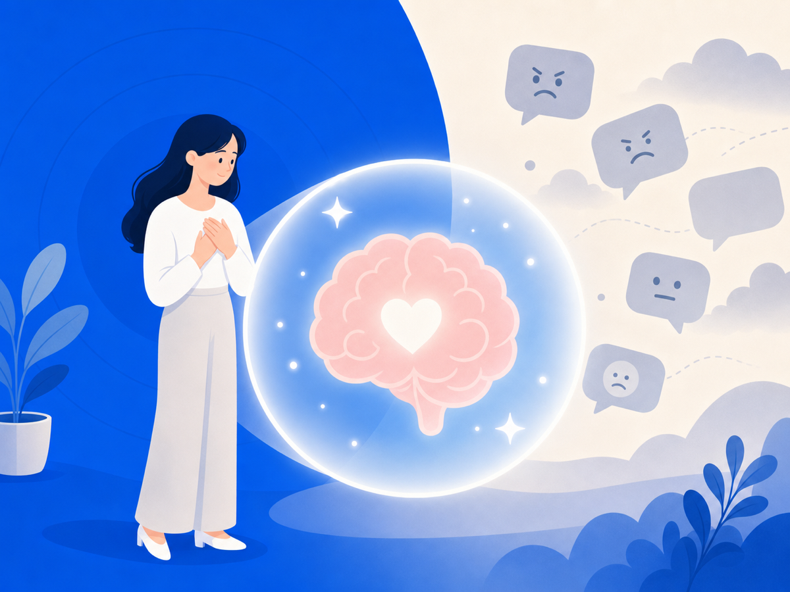

# 악플에 무너지는 건 당신 탓이 아니에요

댓글 수백 개 중 딱 하나의 악플이 눈에 박혀요. 칭찬은 스쳐가는데 비난은 며칠이 지나도 머릿속에서 안 지워지죠. "왜 이렇게 약하지?"라고 스스로를 탓하고 있다면 — 잠깐요. 그건 당신이 약한 게 아니에요. 뇌가 원래 그렇게 작동하도록 만들어져 있어서 그래요.

## 거절은 뇌에 통증으로 등록돼요

2003년, UCLA 심리학자 나오미 아이젠버거와 매슈 리버먼 연구팀이 fMRI로 실험을 했어요. 참가자들이 온라인 게임에서 다른 사람들에게 외면당할 때 뇌에서 어떤 일이 일어나는지 봤더니 — 신체 통증을 처리하는 것과 동일한 뇌 영역, **등쪽 전대상피질(dACC)** 이 켜졌어요. 몸이 다칠 때 켜지는 바로 그 부위예요. 이 연구는 2003년 *Science*에 발표됐어요. 악플이 "그냥 말"이 아닌 이유가 여기 있어요.

## 나쁜 건 좋은 것보다 훨씬 강하게 각인돼요

사회심리학자 로이 바우마이스터 연구팀은 2001년 논문 "Bad Is Stronger Than Good"에서 부정적 경험이 긍정적 경험보다 인지·감정·행동 전반에 더 큰 영향을 미치는 경향이 있다고 정리했어요. UC 버클리 Greater Good Magazine에 인용된 바우마이스터의 말처럼, "하나의 나쁜 것을 상쇄하려면 좋은 것이 여럿 필요"해요.

칭찬은 흘려보내면서 비난만 붙잡히는 건, 의지력 문제가 아니에요. 뇌의 구조적 특성이에요. 나쁜 건 크게, 좋은 건 작게 듣는 귀 — 그게 우리 뇌 기본값이에요.

## 뇌는 50~150명 공동체를 위해 진화했어요

인류는 수십만 년 동안 50~150명의 소규모 집단에서 살아왔어요. 그 집단에서 배척당하면 생존이 위협받았기 때문에, 뇌는 사회적 거절에 극도로 민감하게 반응하도록 진화했어요. 그런데 지금 우리는 수천·수만 명의 익명 다수에게 한꺼번에 공격받는 환경에 있어요. 연구자들은 이걸 **진화적 부조화(evolutionary mismatch)** 라고 불러요. Karabegović 외 연구팀이 2024년 *Evolutionary Psychological Science*에 발표한 논문도, 소규모 집단에서 유리했던 진화적 반응들이 온라인 환경에서는 잘 작동하지 않는다고 설명해요.

무너지는 게 당연해요. 뇌가 그렇게 설계되어 있으니까요.

## 오늘 당장 할 수 있는 한 가지

지금 당장 강해질 필요 없어요. 뇌가 악플을 볼 때마다 통증으로 처리한다면, 노출 자체를 줄이는 것이 뇌를 보호하는 일이에요. 안 보기 위해 의지력을 짜내는 게 아니라 — 그냥 지금 창을 닫는 것. 그것만으로도 충분해요.

---

> 이 글은 일반 정보예요. 구체적인 일은 전문가(상담·변호사)와 상의하세요. 많이 힘들 땐 자살예방상담 **109**(24시간)가 있어요.

## 참고 자료

- [Rejection Really Hurts, UCLA Psychologists Find — ScienceDaily (2003)](https://www.sciencedaily.com/releases/2003/10/031010074045.htm)
- [Does rejection hurt? An fMRI Study of Social Exclusion — PubMed (Eisenberger, Lieberman & Williams, Science 2003)](https://pubmed.ncbi.nlm.nih.gov/14551436/)
- [How to Overcome Your Brain's Fixation on Bad Things — Greater Good Magazine, UC Berkeley (Baumeister 인용)](https://greatergood.berkeley.edu/article/item/how_to_overcome_your_brains_fixation_on_bad_things)
- [Bad Is Stronger Than Good — Roy Baumeister (2001 논문 페이지)](https://roybaumeister.com/2001/10/15/bad-is-stronger-than-good/)
- [Social Media Ills and Evolutionary Mismatches — Evolutionary Psychological Science (Karabegović et al., 2024)](https://link.springer.com/article/10.1007/s40806-024-00398-z)
- [Is Social Pain Real Pain? — Psychology Today (dACC / Eisenberger 연구 해설)](https://www.psychologytoday.com/us/blog/neuroscience-in-everyday-life/201704/is-social-pain-real-pain)
- [Evolutionary Mismatch — Psychology Today](https://www.psychologytoday.com/us/blog/naturally-selected/201804/evolutionary-mismatch)
