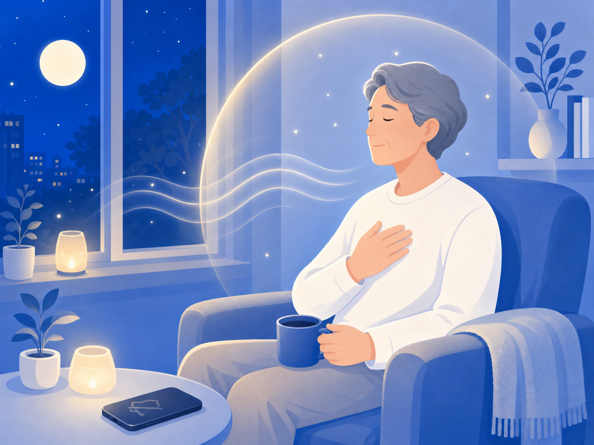

# 마음이 다시 숨 쉬게 하는 작은 방법들

악플을 보고 나면 그 말이 머릿속을 맴돌죠. 더 상처받을 걸 알면서도 손이 가는 건 의지력 문제가 아니에요. 고통에 반응하는 자연스러운 패턴이에요. 그래도 — 마음이 조금씩 숨 쉴 공간을 되찾을 수 있어요.

## 안 보는 건 회피가 아니라 자기보호예요

악성 댓글에 계속 노출되면 불안·우울·수면 장애로까지 번져요. 카스퍼스키 자료에 따르면 사이버폭력 피해자는 불면증, 스트레스성 두통, 식욕 상실 같은 신체 증상을 경험하고 피해는 밤새 지속될 수 있어요. 해로운 정보를 의도적으로 차단하는 건 도망이 아니라, 나를 지키는 행동이에요.

## "나를 탓하지 않아도 돼요"

심리학자 크리스틴 네프(Kristin Neff)는 자기 자비(self-compassion)의 핵심을 세 가지로 말해요. 나 자신을 친절하게 대하기, 고통은 나만의 일이 아닌 인간 공통의 경험임을 기억하기, 감정을 과장하거나 억누르지 않고 그대로 바라보기. self-compassion.org에 따르면 자기 자비는 고통받는 자신을 가까운 친구를 대하듯 따뜻하게 지지하는 태도이고, 회복과 평온에 높은 상관관계를 보여요.

악플은 대부분 나의 잘못과 무관해요. "내가 문제인가"라는 생각이 든다면, 그 생각에 잠시 '알겠어, 그런데 그게 사실은 아니야'라고 말해줘도 괜찮아요.

## 지금 여기로 돌아오는 법 — 5-4-3-2-1

마음이 댓글 속을 맴돌 때 써볼 수 있는 기법이에요. 지금 보이는 것 5가지, 들리는 것 4가지, 만져지는 것 3가지를 차례로 알아차리는 거예요. Healthline에 따르면 이 그라운딩 기법은 불안·PTSD 증상에서 주의를 현재로 이끌어 감정을 안전한 상태로 되돌리는 전략으로 활용돼요.

코로 4초 들이쉬고 입으로 6~8초 내쉬는 호흡만으로도 긴장이 누그러져요. 어디서든 바로 할 수 있어요.

## 몸이 괜찮아야 마음도 버텨요

수면을 지키고, 짧게라도 바깥을 걷는 것이 심리적 회복의 기초예요. 대한의학회 Hanyang Medical Reviews 자료에 따르면 신체활동은 우울·스트레스·수면 장애 개선에 긍정적 영향을 미치고, 중요한 비약물적 접근이에요.

믿을 수 있는 한 사람에게 "요즘 힘들어"라고 말하는 것만으로도 달라져요. 혼자 감당하기 어려울 때는 정신건강복지센터(1577-0199)나 청소년상담복지센터(1388)를 이용할 수 있어요.

## 오늘 가져갈 한 가지

회복에는 시간이 걸려요. 빠르게 털어내지 못해도 괜찮아요. 지금 당장 완전히 나아지지 않아도, 오늘 조금 덜 힘들면 충분해요.

> 이 글은 일반 정보예요. 구체적인 일은 전문가(상담·변호사)와 상의하세요. 많이 힘들 땐 자살예방상담전화 109(24시간)가 있어요.

## 참고 자료

- [카스퍼스키 — 사이버 폭력의 영향에는 어떤 게 있을까요?](https://www.kaspersky.co.kr/resource-center/preemptive-safety/cyberbullying-effects)
- [Kristin Neff — What is Self-Compassion?, self-compassion.org](https://self-compassion.org/what-is-self-compassion/)
- [Healthline — Grounding Techniques: Exercises for Anxiety, PTSD, and More](https://www.healthline.com/health/grounding-techniques)
- [신체활동과 정신건강, 대한의학회 Hanyang Medical Reviews](https://synapse.koreamed.org/upload/synapsedata/pdfdata/0130hmr/hmr-34-60.pdf)
- [Impacts of digital social media detox for mental health, PubMed](https://pubmed.ncbi.nlm.nih.gov/39280291/)
