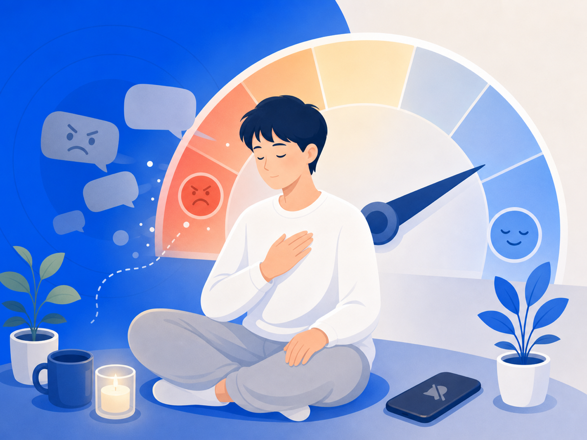

# 악플이 정말 힘든 건, 감정이 안 꺼지기 때문이에요

악플 하나 봤을 뿐인데, 그 감정이 하루 종일 안 꺼진 적 있죠? 화나고, 억울하고, 부끄럽고, 무섭고. 문제는 그 감정이 한 번 올라왔다 가라앉는 게 아니라는 거예요. 다시 확인하고, 머릿속에서 또 돌려보고, 답글을 달까 말까 고민하는 동안 감정은 계속 자극받아요.

## "상처받았다"에서 안 끝나는 이유

2026년 한 심리학 학술지에 큰 연구가 실렸어요. 사이버폭력 피해가 청소년의 우울·불안·자해 같은 문제로 어떻게 이어지는지, 125개 연구를 모아서 살펴본 거예요. 그 길목에서 중요한 다리 역할을 하는 게 바로 '감정조절의 어려움'이었어요.

감정조절이 어렵다는 건 감정이 많다는 뜻이 아니에요. 감정이 너무 빨리 커지거나, 너무 오래 안 가라앉거나, 식힐 통로가 없는 상태에 가까워요. 말하자면 브레이크가 잘 안 듣는 거죠.

악플 피해에서 이런 일이 자주 생겨요. 댓글을 본 직후 심장이 쿵쿵 뛰고, 다시 확인할수록 더 불안해지고, 반박하고 싶은데 더 공격받을까 무섭고, 결국 하루 종일 그 문장만 맴돌아요. 의지가 약해서가 아니에요. 감정 시스템이 계속 경보를 울리고 있는 거예요.

## 그래서 '안 보기'는 소극적인 게 아니에요

많은 사람이 안 보는 걸 '회피'라고 생각해요. 그런데 같은 댓글을 계속 보면서 침착해지기란 거의 불가능해요. 유해한 자극을 줄이는 게 오히려 감정조절의 출발점이 될 수 있어요.

물론 무조건 차단만이 답은 아니에요. 법적 대응이 필요하면 증거도 남겨야 하고, 신고도 해야 하니까요. 하지만 그 과정에서 매번 직접 악플을 읽고, 캡처하고, 정리해야 한다면 회복은 더 멀어져요. 보지 않으면서도 남길 방법을 찾는 게 핵심이에요.

## 그래서 오늘 할 수 있는 건

감정조절은 마음먹기만으로 되지 않아요. 환경이 도와줘야 해요. 끓어오르는 감정에 브레이크가 잘 안 들 때, 그건 당신이 부족해서가 아니라 자극이 너무 가까이 있어서예요.

오늘은 그 자극을 한 뼘만 멀리 둬보세요. 알림을 끄든, 창을 닫든, 그 화면에서 잠깐 물러나든. 감정이 식을 자리를 만들어 주는 것, 그게 지금 할 수 있는 가장 현실적인 보호예요.

> 이 글은 일반 정보예요. 구체적인 법률·의료 판단은 전문가와 상의하세요. 많이 힘들 땐 자살예방상담 109(24시간)가 있어요.

## 참고 자료
- [Li et al. — Mechanisms linking cyberbullying victimisation to internalising problems in youth, Clinical Psychology Review, 2026](https://www.sciencedirect.com/science/article/pii/S0272735825001394)
