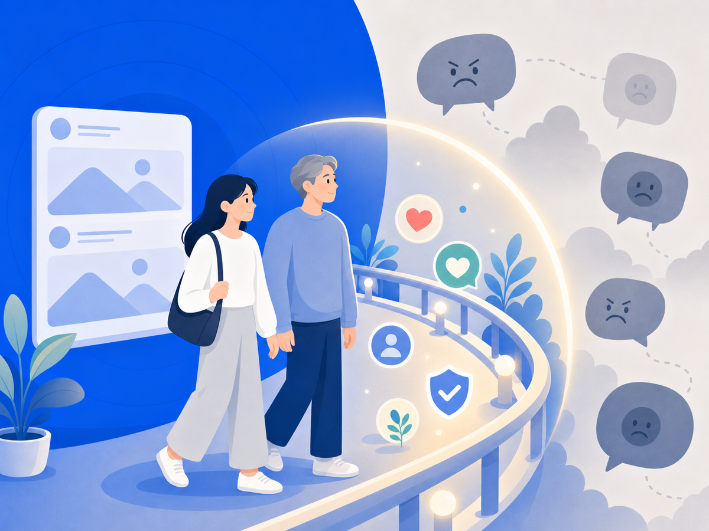

# SNS는 끊는 게 아니라, 안전장치가 필요해요

"SNS 좀 그만해"라는 말, 들어본 적 있죠? 힘들어하는 걸 보면 주변에서 쉽게 하는 말이에요. 그런데 막상 끊으려고 하면 친구도, 일도, 정보도 다 거기 묶여 있어서 잘 안 돼요. 당신이 의지가 없어서가 아니에요.

## SNS는 좋은 것과 해로운 게 한 화면에 섞여 있어요

2025년 Pew Research Center 조사에서, 미국 청소년 대다수가 SNS 덕분에 친구들과 더 연결된다고 답했어요. 동시에 일부는 SNS가 자기 정신건강에 해롭다고도 했고요. 같은 공간이 누군가에겐 연결의 통로고, 누군가에겐 상처의 입구인 거예요.

특히 여학생 쪽에서 정신건강이나 수면에 부정적이라는 응답이 더 많았어요. 같은 플랫폼을 써도 외모 평가나 조롱, 악성 댓글에 더 많이 노출되는 사람이 따로 있다는 뜻이에요.

## "그냥 하지 마"가 답이 안 되는 이유

청소년, 창작자, 프리랜서, 자영업자, 공인에게 SNS는 단순한 놀이가 아니에요. 관계도, 일도, 홍보도 다 얽혀 있죠. 그러니 "그냥 끊어"는 현실적인 조언이 못 돼요. 좋은 연결까지 통째로 잘라내야 하니까요.

필요한 건 전부 끊는 게 아니라, 나를 반복해서 무너뜨리는 부분만 덜 보이게 하는 거예요. 음악은 켜두고 소음만 줄이는 노이즈 캔슬링처럼요.

## 그래서 오늘 할 수 있는 건

선택지가 꼭 둘만 있는 건 아니에요. 전부 끊으면 좋은 것까지 사라지고, 무방비로 쓰면 악플까지 계속 들어와요. 그 사이에 '필요한 건 남기고 해로운 노출만 줄이는' 길이 있어요.

오늘은 작은 것부터요. 나를 자꾸 다치게 하는 계정이나 키워드 알림을 꺼두고, 보는 시간에 경계를 그어두세요. 당신을 더 강하게 만들라는 게 아니에요. 덜 다치도록 환경을 바꾸는 거예요.

> 이 글은 일반 정보예요. 구체적인 법률·의료 판단은 전문가와 상의하세요. 많이 힘들 땐 자살예방상담 109(24시간)가 있어요.

## 참고 자료
- [Pew Research Center — Social Media and Teens' Mental Health, 2025](https://www.pewresearch.org/internet/2025/04/22/teens-social-media-and-mental-health/)
