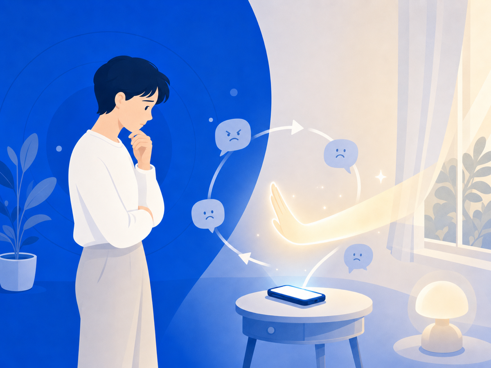

# 왜 상처받는 걸 알면서도 또 확인할까요

분명히 안 보겠다고 다짐했는데, 손이 먼저 움직여서 또 그 화면을 열고 있죠. 보고 나면 후회하면서도요. "내가 왜 이러지?" 자책이 따라붙고요. 그런데 이건 당신이 이상해서가 아니에요. 불안과 확인 충동이 얽힌 '루프'에 갇혀 있는 거예요.

## 불안할수록 더 확인하고, 확인할수록 더 불안해져요

2026년 한 학술지에 실린 연구가 있어요. 12~18세 학생 1,000여 명을 살펴봤더니, 휴대폰과 SNS를 문제적으로 많이 쓰는 학생일수록 사이버피해와 사회불안 점수도 높았어요.

악플이나 조롱글을 발견하면 우리는 본능적으로 상황을 파악하려 해요. "더 퍼졌나? 누가 봤지? 답글 또 달렸나?" 확인은 잠깐 안심을 줘요. 그런데 새 댓글, 새 공유를 보는 순간 불안이 다시 커지고, 그래서 또 확인하게 돼요. 가려운 데를 긁으면 잠깐 시원하지만 결국 더 가려워지는 것처럼요.

## 남의 시선이 무서울수록 더 그래요

연구는 이 충동이 사회불안과도 연결된다고 봐요. 남이 나를 어떻게 볼지 두려울수록, 온라인 반응을 확인하려는 마음이 커지거든요.

악플 피해자는 특히 그래요. 나에 대한 부정적인 평가가 진짜로 공개돼 있는 상태니까요. 당신이 과민한 게 아니에요. 불안을 키우는 정보가 눈앞에 계속 놓여 있는 상황인 거예요.

## 그래서 오늘 할 수 있는 건

"그냥 보지 마"는 쉬운 말이지만, 실제로는 정말 어려워요. 알림, 검색, 추천, 단톡방 캡처가 계속 그 화면으로 돌아오게 만드니까요. 그래서 필요한 건 의지력보다 '구조'예요.

오늘은 그 루프로 돌아가게 만드는 길목 하나를 막아보세요. 알림 끄기, 검색 기록 지우기, 자꾸 들어가는 앱을 화면 구석으로 치워두기. 작은 차단 하나가, 다시 확인할 때마다 상처가 새로 생기는 걸 줄여줘요.

> 이 글은 일반 정보예요. 구체적인 법률·의료 판단은 전문가와 상의하세요. 많이 힘들 땐 자살예방상담 109(24시간)가 있어요.

## 참고 자료
- [Guisot et al. — Problematic mobile phone and social media use among adolescents and its relationship with cyberbullying, cybervictimisation and social anxiety, Scientific Reports, 2026](https://www.nature.com/articles/s41598-026-35842-6)
