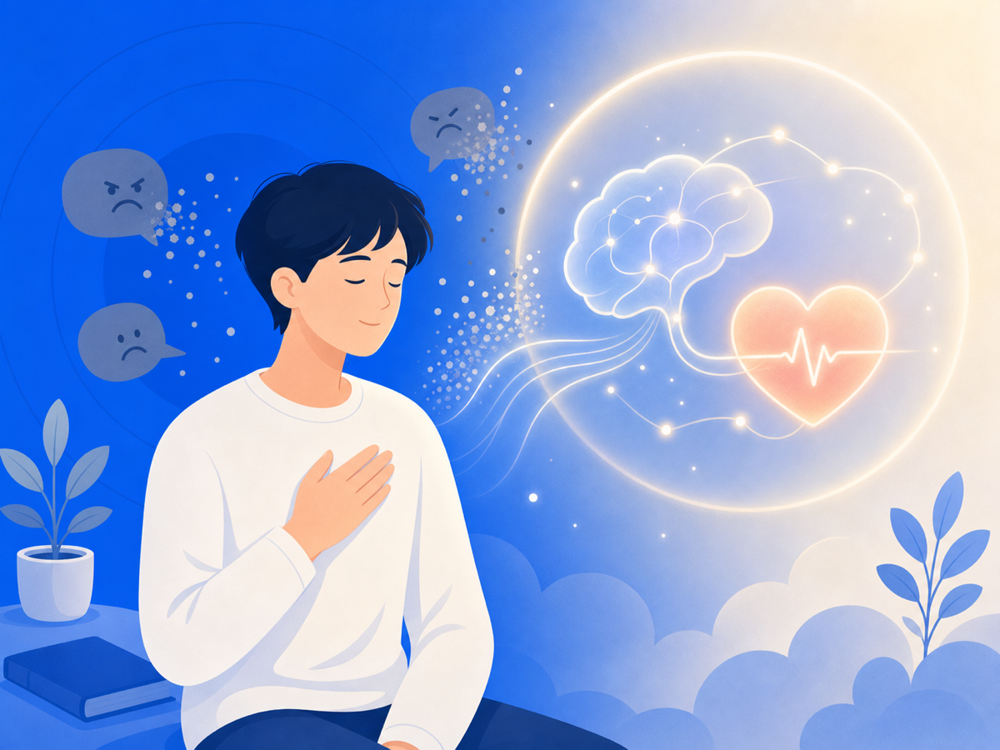

# 악플이 아픈 건 과장이 아니에요

"댓글일 뿐인데 왜 그렇게 힘들어해?" 악플 피해자가 정말 자주 듣는 말이에요. 그 말 들으면 더 외로워지죠. 내 고통이 별것 아닌 것처럼 느껴지니까요. 그런데요, 거절과 배제는 그냥 기분 문제가 아니에요. 뇌는 그걸 진짜 위협처럼 처리해요.

## 거절은 뇌에서 '통증'으로 처리돼요

2003년 *Science*에 실린 유명한 연구가 있어요. 사람이 사회적으로 따돌림당할 때 뇌를 fMRI로 찍었더니, 몸이 다칠 때 켜지는 영역이 같이 켜졌어요. 이후 여러 연구도 따돌림이나 또래 괴롭힘이 신체 통증과 겹치는 회로와 관련될 수 있다고 봤고요.

비유가 아니라 진짜예요. 악플이 "그냥 말"이 아닌 이유가 여기 있어요.

## 온라인 배제도 똑같이 아파요

오프라인에서 따돌림당하면 아프죠. 온라인에선 그 아픔이 더 이상한 모양으로 와요. 얼굴 한 번 안 봤는데, 수십 명이 보는 댓글창에서 조롱당하고 있다는 사실만으로도 몸이 굳어요.

악플은 말이지만, 사실은 사회적 신호예요. "너는 받아들여지지 않아", "사람들이 너를 싫어해" 같은 신호요. 뇌는 이런 걸 절대 가볍게 처리하지 않아요. 평판이나 소속감이 중요한 사람일수록 더 크게 반응하고요.

## 그래서 다시 보는 게 위험해요

한 번 본 악플도 아픈데, 다시 보고 또 보면 뇌는 그 사회적 위협을 반복해서 겪어요. 스크린샷을 정리하고, 댓글을 다시 읽고, 누가 좋아요 눌렀나 확인하는 것 — 전부 '재노출'이에요. 아문 상처를 자꾸 손으로 뜯는 셈이죠.

당신이 약해서가 아니에요. 사회적 고통을 계속 다시 켜는 환경이 문제예요.

## 그래서 오늘 할 수 있는 건

고통을 과장하지 않아도 돼요. 뇌는 이미 충분히 심각하게 받아들이고 있으니까요. 그러니 "별것도 아닌데 왜 이러지"라고 자신을 다그치지 마세요.

악플을 본 뒤 마음을 가라앉히는 것도 중요하지만, 애초에 안 봐도 되는 걸 줄이는 게 더 빠른 보호일 수 있어요. 보이는 순간 반응이 시작되거든요. 오늘은 그 시작점 하나를 닫아두세요.

> 이 글은 일반 정보이며 의료 자문이 아니에요. 구체적인 어려움은 전문 상담을 권해요. 많이 힘들 땐 자살예방상담 109(24시간)가 있어요.

## 참고 자료
- [Eisenberger et al. — Does rejection hurt? An fMRI study of social exclusion, PubMed](https://pubmed.ncbi.nlm.nih.gov/14551436/)
- [Scientific American — Rejection a Real Pain, Brain Study Shows](https://www.scientificamerican.com/article/rejection-a-real-pain-bra/)
- [Peer-victimisation and brain outcomes systematic review, PMC](https://pmc.ncbi.nlm.nih.gov/articles/PMC10242938/)
